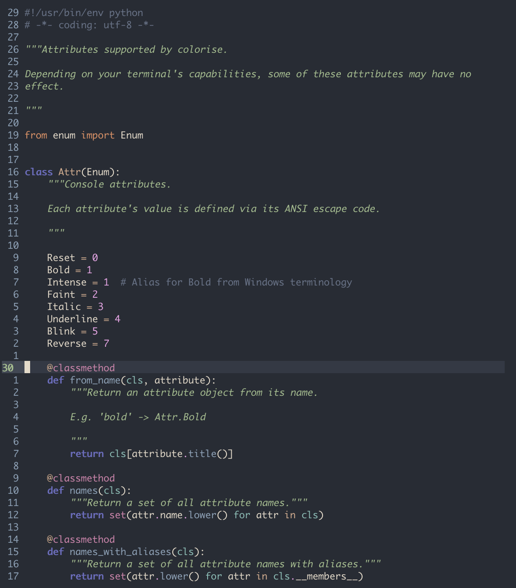

<div align="center">
  <div>
    
  </div>
  <div>
    <p><i>Yet another dark colorscheme for vim</i></p>
  </div>
  <div>
    
    <a href="/LICENSE">
      
    </a>
    
  </div>
</div>

---

## Install

Install via `git` or use your favorite plugin manager.

```bash
$ git clone https://github.com/MisanthropicBit/vim-warlock
$ cp ./vim-warlock/colors/warlock.vim ~/.vim/colors/
```

Please see the [docs](docs/warlock.txt) for configuration. For better syntax
highlighting, install [vim-polyglot](https://github.com/sheerun/vim-polyglot) or
a subset of the language packs that it uses.

Do `set termguicolors` in your vimrc to enable 24-bit colors.

## Configuration

Please see [the docs](doc/warlock.txt).

## Screenshots

### Python (with [python-syntax](https://github.com/vim-python/python-syntax))

<div align="center">
  
</div>
